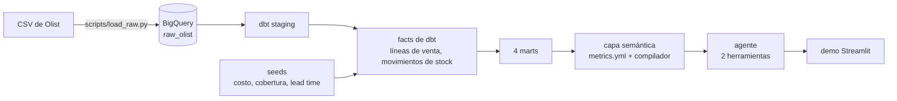

# Olist retail: un agente de métricas que nunca escribe SQL

[](https://github.com/talcaldeg/olist-retail/actions/workflows/tests.yml)
[](https://github.com/talcaldeg/olist-retail/actions/workflows/refresh.yml)

*[Read in English](README.md)*

Si a un modelo de lenguaje se le pide SQL sobre un esquema crudo, casi siempre entrega algo
que corre. Otra cosa es que calcule la cifra que el negocio tiene en mente. Este proyecto
toma el camino contrario: las preguntas de negocio se definen una vez, en dbt y en una capa
semántica pequeña, y el modelo solo elige cuál de ellas se está haciendo. No puede escribir
SQL, y cuando una pregunta queda fuera de lo definido, lo dice en vez de improvisar.

Construido sobre el dataset de comercio electrónico brasileño de
[Olist](https://www.kaggle.com/datasets/olistbr/brazilian-ecommerce) (unas 100.000
órdenes, de 2016 a 2018), en BigQuery y a costo cero.

## Qué responde

Cuatro preguntas que de verdad hace un gerente de retail, un mart de dbt por cada una, con
grano mes x categoría:

| Pregunta | Métrica | En la ventana de reporte* |
|---|---|---|
| ¿Qué categorías dejan margen? | `gross_margin_pct` | 39,5% |
| ¿Qué tan rápido rota el stock? | `inventory_turnover` | 2,45 vueltas al año |
| ¿Cada cuánto se vende algo que no está en stock? | `stockout_rate` | 16,2% de las unidades |
| ¿Cuántos días dura lo que hay en bodega? | `days_of_cover` | 203 días (agosto de 2018) |

\* Enero de 2017 a agosto de 2018. Cifras del build del 24 de septiembre de 2026.

Lo interesante es la combinación: quiebres de stock y stock inmovilizado al mismo tiempo.
El 85% de las unidades en bodega a fines de agosto de 2018 era de pares producto-vendedor
que no vendieron nada ese mes, mientras los productos que sí se vendían se quedaban sin
stock (`computers_accessories` vendió sin stock el 37% de sus unidades en marzo de 2018,
con 90 días de cobertura en el papel). Una política que repone lo vendido el mes anterior
para todos los productos por igual no libera el stock lento ni acompaña el crecimiento. El
detalle está en [docs/marts.md](docs/marts.md).

## El vacío de datos, declarado de entrada

Olist publica qué se vendió, quién lo vendió y a qué precio. No publica el costo unitario
ni el stock, y ningún dataset público de retail lo hace (Favorita, M5 y Online Retail II
tienen el mismo vacío). Sin ellos no hay margen, rotación ni cobertura.

En vez de renunciar a esas preguntas, el proyecto llena el vacío con tres seeds de dbt
versionados (proporción de costo, meses de cobertura y lead time por familia de
categorías), los aplica igual en todas partes y los documenta en
[docs/assumptions.md](docs/assumptions.md). Las unidades, los ingresos, las fechas y la
mezcla de categorías son reales; los niveles de costo y de stock son sintéticos, y la
documentación dice qué conclusión depende de qué.

## Cómo encaja todo



1. **Ingesta.** `scripts/load_raw.py` descarga las nueve tablas de Olist y las carga en
   BigQuery de forma idempotente, contrastando el número de filas con el dataset publicado.
2. **dbt.** Modelos de staging uno a uno con el crudo, dos facts (`fct_venta_linea` para
   las líneas de venta y `fct_movimiento_stock` para un libro de stock simulado por
   producto y vendedor) y cuatro marts. Cada mart guarda las partes sumables de su razón
   junto a la razón, así un trimestre o una familia de categorías se vuelve a dividir y
   nunca se promedia.
3. **Capa semántica.** [semantic/metrics.yml](semantic/metrics.yml) define las cuatro
   métricas y las dimensiones por las que se pueden abrir. Un compilador determinista
   convierte {métrica, dimensiones, filtros, periodo} en SQL; la misma pregunta produce
   siempre el mismo SQL. Ver [docs/semantic.md](docs/semantic.md).
4. **Agente.** Un modelo de lenguaje con exactamente dos herramientas, `listar_metricas` y
   `consultar_metrica`. El modelo enruta y el compilador escribe el SQL. Una pregunta
   cuenta como respondida solo si una consulta pasó por el compilador, de modo que una
   respuesta segura sin consulta detrás queda registrada como rechazo. Ver
   [docs/agent.md](docs/agent.md).

## Cómo se prueba

Los tests son el centro del proyecto, más que el modelado.

| Capa | Qué se verifica | Cuándo |
|---|---|---|
| dbt | Nueve tests singulares sobre invariantes del negocio: los marts cuadran con el crudo al centavo, los cuatro marts coinciden entre sí, cada mes de stock abre donde cerró el anterior, las razones no salen de su rango y los seeds no salen de sus límites | cada `dbt build` |
| Capa semántica | Golden files con el SQL revisado de once preguntas; dieciocho preguntas que deben rechazarse, incluido un intento de inyección | cada push |
| Capa semántica, en vivo | El SQL compilado reproduce fila a fila cada razón de los cuatro marts y las cifras citadas en la documentación | refresco mensual |
| Agente | El ciclo del agente con un modelo falso guionado: los errores del compilador vuelven al modelo, y una respuesta sin consulta es un rechazo | cada push |
| Eval del agente | 33 preguntas, evaluadas por el ruteo (métrica, dimensiones, filtros, periodo) y no por la redacción | a pedido |

Último eval con `gemini-3.1-flash-lite` ([docs/agent_eval.md](docs/agent_eval.md)):

| Verificación | Resultado |
|---|---|
| Todas las preguntas correctas | 32/33 (97%) |
| Preguntas respondibles, llamada exacta | 22/23 |
| Preguntas respondibles, métrica correcta | 23/23 |
| Preguntas trampa rechazadas (ingresos, vendedores, pronósticos, SQL crudo, escenarios hipotéticos...) | 10/10 |

El único error agregó una dimensión de agrupación de más; la métrica, los filtros y el
periodo estaban bien.

## Cómo correrlo

Se necesita Python 3.12, un proyecto de Google Cloud con BigQuery (basta el sandbox
gratuito, sin cuenta de facturación) y, para el agente, una
[clave gratuita de Gemini](https://aistudio.google.com/apikey).

```bash
pip install -r requirements.txt
gcloud auth application-default login
export OLIST_GCP_PROJECT=su-proyecto

python scripts/load_raw.py          # descarga Olist y carga raw_olist
dbt build --profiles-dir .          # modelos, seeds y tests
python -m pytest                    # tests offline, sin credenciales
OLIST_LIVE_TESTS=1 python -m pytest # verificaciones en vivo contra los marts
```

Después, la capa semántica y el agente:

```bash
python -m semantic days_of_cover --by quarter --where category_family=home --period 2018 --sql
echo "GEMINI_API_KEY=..." > .env
python -m agent "¿Cuál fue la tasa de quiebre por trimestre en 2018 para la familia electrónica?"
streamlit run agent/demo.py
```

`OLIST_AGENT_MODEL` cambia el agente a cualquier modelo que soporte
[litellm](https://docs.litellm.ai/), por ejemplo `groq/llama-3.3-70b-versatile`.

## Costo

Cero, por diseño. El proyecto de GCP corre en el sandbox de BigQuery sin cuenta de
facturación enlazada, así que no se le puede cobrar; además, cada consulta de dbt tiene un
tope de 1 GB leído. El sandbox borra las tablas a los 60 días, por lo que una GitHub Action
recarga y reconstruye todo el día 1 de cada mes, autenticándose por Workload Identity
Federation sin ninguna llave guardada. El agente usa el nivel gratuito de Gemini.

## Estructura del repositorio

```
scripts/load_raw.py      ingesta a BigQuery
models/                  dbt: staging, intermediate, dimensional, marts
seeds/                   los tres supuestos de costo y stock
tests/                   tests singulares de dbt
semantic/                metrics.yml, compilador, SQL de referencia, tests en vivo
agent/                   ciclo del agente, preguntas y runner del eval, demo Streamlit
docs/                    supuestos, marts, capa semántica, agente, último eval
.github/workflows/       tests en cada push, refresco mensual
```

## Stack

BigQuery, dbt 1.12, Python 3.12, litellm con Gemini, Streamlit, pytest, GitHub Actions.

## Datos y licencia

Olist publica su dataset en Kaggle con licencia CC BY-NC-SA 4.0; el loader lee un espejo
público para que el proyecto corra sin credenciales de Kaggle. Las cifras de costo y de
stock son sintéticas, como se explica en [docs/assumptions.md](docs/assumptions.md). La
documentación técnica en `docs/` está en inglés.

## Autor

Tomás Alcalde, consultor de negocio y BI. [talcaldeg.github.io](https://talcaldeg.github.io)
