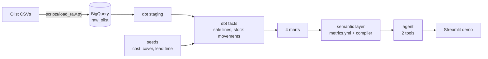

# Olist retail: a metrics agent that never writes SQL

[](https://github.com/talcaldeg/olist-retail/actions/workflows/tests.yml)
[](https://github.com/talcaldeg/olist-retail/actions/workflows/refresh.yml)

*[Leer en español](README.es.md)*

Ask a language model for SQL over a raw schema and it will usually give you something that
runs. Whether it computed the number the business means is another matter. This project
takes the opposite route: the business questions are defined once, in dbt and a small
semantic layer, and the model's only job is to pick which question is being asked. It
cannot write SQL, and when a question falls outside what is defined, it says so instead
of improvising.

Built on the [Olist](https://www.kaggle.com/datasets/olistbr/brazilian-ecommerce) Brazilian
e-commerce dataset (about 100,000 orders, 2016 to 2018), in BigQuery, at zero cost.

## What it answers

Four questions a retail manager actually asks, one dbt mart each, at month x category grain:

| Question | Metric | Over the reporting window* |
|---|---|---|
| Which categories make money? | `gross_margin_pct` | 39.5% |
| How fast does stock turn? | `inventory_turnover` | 2.45 turns a year |
| How often is a sale not in stock? | `stockout_rate` | 16.2% of units |
| How many days does the shelf last? | `days_of_cover` | 203 days (August 2018) |

\* January 2017 to August 2018. Figures from the build of 24 September 2026.

The interesting part is the combination: stockouts and idle stock at the same time. 85% of
the units on the shelf at the end of August 2018 belonged to product-seller pairs that sold
nothing that month, while the items that did sell kept running out (`computers_accessories`
backordered 37% of its units in March 2018 with 90 days of cover on paper). A reorder policy
that replaces last month's sales for every item alike neither clears slow stock nor keeps
up with growth. Details in [docs/marts.md](docs/marts.md).

## The data gap, stated up front

Olist publishes what was sold, by whom and at what price. It does not publish unit cost or
stock, and no public retail dataset does (Favorita, M5 and Online Retail II have the same
gap). Without them there is no margin, turnover or cover.

Rather than drop those questions, the project fills the gap with three versioned dbt seeds
(cost ratio, months of cover and lead time per category family), applies them the same way
everywhere and documents them in [docs/assumptions.md](docs/assumptions.md). Units,
revenue, dates and category mix are real; cost and stock levels are synthetic, and the docs
say which conclusions depend on which.

## How it fits together



1. **Ingestion.** `scripts/load_raw.py` downloads the nine Olist tables and loads them into
   BigQuery, idempotently, checking row counts against the published dataset.
2. **dbt.** Staging models one to one with the raw tables, two facts (`fct_venta_linea` for
   sale lines, `fct_movimiento_stock` for a simulated stock ledger per product and seller)
   and four marts. Each mart stores the additive parts of its ratio next to the ratio, so a
   quarter or a category family is re-divided, never averaged.
3. **Semantic layer.** [semantic/metrics.yml](semantic/metrics.yml) defines the four
   metrics and the dimensions they can be cut by. A deterministic compiler turns
   {metric, dimensions, filters, period} into SQL; the same question always produces the
   same SQL. See [docs/semantic.md](docs/semantic.md).
4. **Agent.** A language model with exactly two tools, `listar_metricas` and
   `consultar_metrica`. It routes; the compiler writes the SQL. A question counts as
   answered only if a query went through the compiler, so a confident reply with no query
   behind it is recorded as a rejection. See [docs/agent.md](docs/agent.md).

## How it is tested

Tests are the point of the project, more than the modelling.

| Layer | What is checked | When |
|---|---|---|
| dbt | Nine singular tests on business invariants: marts reconcile with the raw tables to the cent, the four marts agree with each other, every stock month opens where the previous one closed, ratios stay in range, seeds stay within bounds | every `dbt build` |
| Semantic layer | Golden files with the reviewed SQL of eleven questions; eighteen questions that must be rejected, including an injection attempt | every push |
| Semantic layer, live | The compiled SQL reproduces every ratio of the four marts row by row, and the figures quoted in the docs | monthly refresh |
| Agent | The agent loop with a scripted fake model: compiler errors go back to the model, a claim without a query is a rejection | every push |
| Agent eval | 33 questions, scored on routing (metric, dimensions, filters, period), not on prose | on demand |

Latest eval with `gemini-3.1-flash-lite` ([docs/agent_eval.md](docs/agent_eval.md)):

| Check | Result |
|---|---|
| All questions right | 32/33 (97%) |
| Answerable questions, exact call | 22/23 |
| Answerable questions, metric right | 23/23 |
| Trap questions rejected (revenue, sellers, forecasts, raw SQL, what-ifs...) | 10/10 |

The one miss added an extra grouping dimension; the metric, filters and period were right.

## Run it yourself

You need Python 3.12, a Google Cloud project with BigQuery (the free sandbox is enough, no
billing account required) and, for the agent, a free
[Gemini API key](https://aistudio.google.com/apikey).

```bash
pip install -r requirements.txt
gcloud auth application-default login
export OLIST_GCP_PROJECT=your-project-id

python scripts/load_raw.py          # download Olist and load raw_olist
dbt build --profiles-dir .          # models, seeds and tests
python -m pytest                    # offline tests, no credentials needed
OLIST_LIVE_TESTS=1 python -m pytest # live checks against the marts
```

Then the semantic layer and the agent:

```bash
python -m semantic days_of_cover --by quarter --where category_family=home --period 2018 --sql
echo "GEMINI_API_KEY=..." > .env
python -m agent "What was the stockout rate by quarter in 2018 for the electronics family?"
streamlit run agent/demo.py
```

`OLIST_AGENT_MODEL` switches the agent to any model [litellm](https://docs.litellm.ai/)
supports, for example `groq/llama-3.3-70b-versatile`.

## Cost

Zero, by construction. The GCP project runs in the BigQuery sandbox with no billing account
linked, so it cannot be charged; every dbt query is also capped at 1 GB scanned. The sandbox
deletes tables after 60 days, so a GitHub Action reloads and rebuilds everything on the
first of each month, authenticating through Workload Identity Federation with no stored
key. The agent runs on Gemini's free tier.

## Repository layout

```
scripts/load_raw.py      ingestion into BigQuery
models/                  dbt: staging, intermediate, dimensional, marts
seeds/                   the three cost and stock assumptions
tests/                   dbt singular tests
semantic/                metrics.yml, compiler, golden SQL, live tests
agent/                   agent loop, eval questions and runner, Streamlit demo
docs/                    assumptions, marts, semantic layer, agent, latest eval
.github/workflows/       tests on push, monthly refresh
```

## Stack

BigQuery, dbt 1.12, Python 3.12, litellm with Gemini, Streamlit, pytest, GitHub Actions.

## Data and license

The Olist dataset is published by Olist on Kaggle under CC BY-NC-SA 4.0; the loader reads a
public mirror so the project runs without Kaggle credentials. Cost and stock figures are
synthetic, as described in [docs/assumptions.md](docs/assumptions.md).

## Author

Tomás Alcalde, business and BI consultant. [talcaldeg.github.io](https://talcaldeg.github.io)
